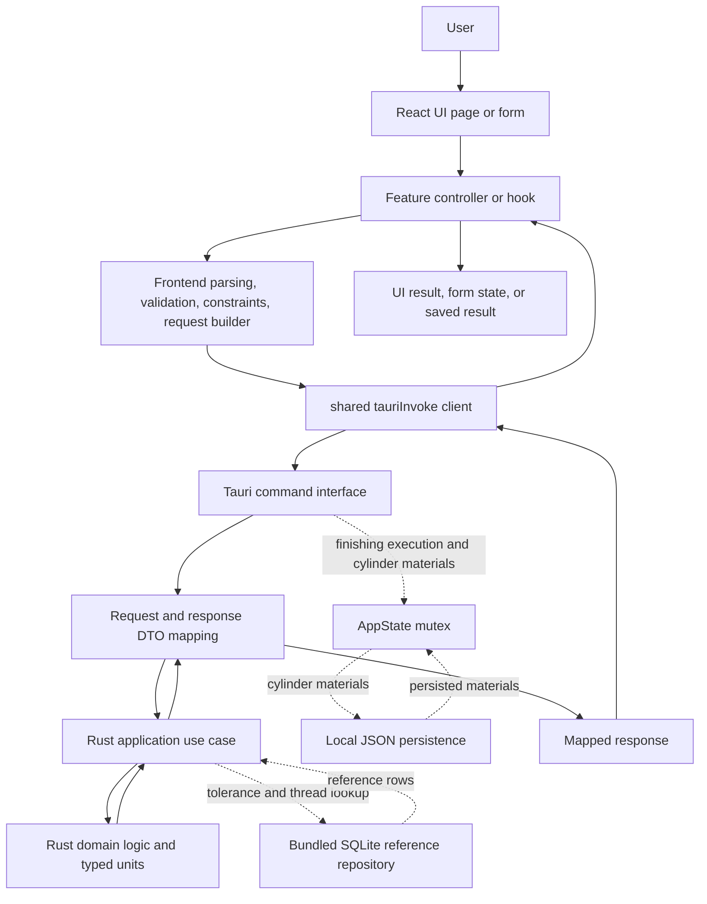

# Architecture

This document describes the application architecture as it exists today. It is
intended for new developers, technical reviewers, and readers who want to
understand the main design choices without reading the whole repository.

It documents the current implementation. It does not prove professional CNC
correctness, standards compliance, production readiness, or complete runtime
verification. Test status and verification boundaries are documented in
[`testing.md`](./testing.md).

## System Overview

The project is a Tauri 2 desktop application. The frontend is a React and
TypeScript application started from [`src/main.tsx`](../src/main.tsx). The Rust
backend is the Tauri crate under [`src-tauri/`](../src-tauri), with
[`src-tauri/src/main.rs`](../src-tauri/src/main.rs) calling
`cnc_machining_system_lib::run()` from
[`src-tauri/src/lib.rs`](../src-tauri/src/lib.rs).

The application uses local reference data and local persistence:

- bundled ISO 286 reference data in `data/iso286.sqlite`, configured in
  [`src-tauri/tauri.conf.json`](../src-tauri/tauri.conf.json)
- bundled thread reference data in `data/threads.sqlite`, configured in
  [`src-tauri/tauri.conf.json`](../src-tauri/tauri.conf.json)
- user-modifiable cylinder material data stored as `cylinder_materials.json` in
  the Tauri application data directory by
  [`JsonCylinderMaterialRepository`](../src-tauri/src/application/cylinder_weight/material_repository.rs)
- frontend in-memory form and history state managed by
  [`FormStateProvider`](../src/app/providers/FormStateProvider.tsx) and
  [`useSavedResults`](../src/shared/savedResults/useSavedResults.ts)

Repository inspection found Tauri invoke clients but no external backend service
client. Frontend feature clients call Rust through
[`tauriInvoke`](../src/shared/api/tauriClient.ts). The Rust dependency list in
[`src-tauri/Cargo.toml`](../src-tauri/Cargo.toml) includes Tauri, Serde,
ThisError, Proptest, UUID, and bundled Rusqlite, but no HTTP server framework.

## High-Level Architecture

The diagram reflects the current structure: frontend pages and controllers live
under [`src/features/`](../src/features), shared frontend helpers live under
[`src/shared/`](../src/shared), Tauri commands live under
[`src-tauri/src/interface/tauri/`](../src-tauri/src/interface/tauri), application
use cases live under [`src-tauri/src/application/`](../src-tauri/src/application),
and domain logic lives under [`src-tauri/src/domain/`](../src-tauri/src/domain).

## Frontend Architecture

The frontend entry point is [`src/main.tsx`](../src/main.tsx). It creates the
React root, wraps the app in `BrowserRouter`, and applies
[`AppProviders`](../src/app/providers/AppProviders.tsx).

[`src/app/App.tsx`](../src/app/App.tsx) renders
[`AppShell`](../src/app/shell/AppShell.tsx) around
[`AppRoutes`](../src/app/routes.tsx). Routes map calculator pages such as
`/triangle`, `/helix`, `/cutting`, `/tolerances`, `/threads`, `/finishing`, and
`/cylinder-weight` to feature pages.

Application-wide providers are composed in
[`AppProviders`](../src/app/providers/AppProviders.tsx):

- [`ThemeProvider`](../src/app/providers/ThemeProvider.tsx)
- [`DisplaySettingProvider`](../src/app/providers/DisplaySettingProvider.tsx)
- [`TitleContextProvider`](../src/app/providers/TitleContextProvider.tsx)
- [`FormStateProvider`](../src/app/providers/FormStateProvider.tsx)

Feature code is organized under [`src/features/`](../src/features). Feature
structure varies by workflow, but feature modules commonly contain UI
components, page controllers or hooks, frontend domain helpers, API adapters,
and request/response types. Representative examples are:

- cutting data page/controller/API/domain files under
  [`src/features/cuttingData/`](../src/features/cuttingData)
- helix UI, API, and frontend domain helpers under
  [`src/features/helix/`](../src/features/helix)
- finishing plan and execution flows under
  [`src/features/finishing/`](../src/features/finishing)
- cylinder weight materials and calculation UI under
  [`src/features/cylinder_weight/`](../src/features/cylinder_weight)

Frontend parsing and request construction happen before Tauri invocation. For
cutting data, [`parseCuttingData`](../src/features/cuttingData/domain/parseCuttingData.ts)
uses [`safeParseDecimal`](../src/shared/parsing/decimalParser.ts), and
[`buildCuttingDataRequest`](../src/features/cuttingData/domain/buildRequest.ts)
maps frontend form keys to backend request field names.

Shared form behavior lives in
[`formEngine.ts`](../src/shared/form/engine/formEngine.ts). It handles user
edits, driver constraints, frontend validation, async calculation and generation
calls, machine result application, and field-level command errors. Shared
constraints are under [`src/shared/form/constraints/`](../src/shared/form/constraints).

Saved results are frontend state, not durable storage. The
[`useSavedResults`](../src/shared/savedResults/useSavedResults.ts) hook stores
history through [`useFeatureForm`](../src/app/providers/FormStateProvider.tsx),
generates entry IDs with `crypto.randomUUID()`, and clones entries with
`structuredClone()`.

## Tauri Boundary

The Tauri command boundary is registered in
[`src-tauri/src/lib.rs`](../src-tauri/src/lib.rs) through
`tauri::generate_handler!`. Registered commands include:

- `solve_right_triangle`
- `solve_helix`
- `solve_cutting_data`
- `calculate_iso286_fit`
- `lookup_iso286_tolerance`
- `list_iso286_tolerance_options`
- `list_thread_options`
- `solve_thread`
- cylinder material and cylinder weight commands
- finishing plan and measurement commands

Frontend feature clients call these commands through
[`tauriInvoke`](../src/shared/api/tauriClient.ts), which wraps Tauri's
`invoke<T>()`. Representative clients include:

- [`src/features/cuttingData/api/client.ts`](../src/features/cuttingData/api/client.ts)
- [`src/features/helix/api/client.ts`](../src/features/helix/api/client.ts)
- [`src/features/threads/api/client.ts`](../src/features/threads/api/client.ts)
- [`src/features/cylinder_weight/api/client.ts`](../src/features/cylinder_weight/api/client.ts)

The Rust command modules live under
[`src-tauri/src/interface/tauri/`](../src-tauri/src/interface/tauri). Request and
response DTOs are defined per command area, for example
[`request.rs`](../src-tauri/src/interface/tauri/cutting_data/request.rs),
[`response.rs`](../src-tauri/src/interface/tauri/cutting_data/response.rs), and
[`mapping.rs`](../src-tauri/src/interface/tauri/cutting_data/mapping.rs) for
cutting data.

Responsibilities are split across the boundary:

- frontend code parses user text, applies frontend-only form constraints, and
  builds command payloads
- Tauri command modules receive typed request DTOs and call application use
  cases
- mapping modules translate between interface DTOs and application DTOs
- calculator use cases such as cutting data, helix, and right triangle parse
  primitive inputs into domain value types before calling domain logic
- thread and tolerance flows currently combine application use cases with
  repository lookup and domain parsing helpers
- domain modules own CNC calculations and invariants

## Rust Backend Architecture

The Rust backend uses an interface/application/domain organization.

| Layer       | Responsibility                                                                                      | Representative paths                                                 | Dependency direction                                     |
| ----------- | --------------------------------------------------------------------------------------------------- | -------------------------------------------------------------------- | -------------------------------------------------------- |
| Interface   | Tauri commands, request/response DTOs, transport mapping, Tauri-facing errors, runtime state access | [`src-tauri/src/interface/tauri/`](../src-tauri/src/interface/tauri) | Calls application layer and maps errors for the UI       |
| Application | Use cases, input parsing, validation aggregation, repositories, persistence adapters                | [`src-tauri/src/application/`](../src-tauri/src/application)         | Uses domain logic and repository implementations         |
| Domain      | CNC calculations, geometry, units, value constraints, business invariants                           | [`src-tauri/src/domain/`](../src-tauri/src/domain)                   | Does not depend on Tauri or React in the inspected files |

Repository and persistence implementations currently live in the application
layer. Examples include
[`tolerance/repository.rs`](../src-tauri/src/application/tolerance/repository.rs),
[`thread/repository.rs`](../src-tauri/src/application/thread/repository.rs), and
[`cylinder_weight/material_repository.rs`](../src-tauri/src/application/cylinder_weight/material_repository.rs).
Runtime state locking currently happens in the Tauri interface layer for
finishing execution and cylinder materials. Packaged-versus-development SQLite
resource path resolution also currently happens in the tolerance and thread
Tauri command modules before application repositories open the databases.

## Representative Calculation Flow: Cutting Data

This flow traces a cutting-data calculation from user input to displayed result.

| Step                          | Responsibility                                                                          | Concrete source                                                                                                       |
| ----------------------------- | --------------------------------------------------------------------------------------- | --------------------------------------------------------------------------------------------------------------------- |
| Page renders form and history | UI composition                                                                          | [`CuttingDataPage`](../src/features/cuttingData/ui/CuttingDataPage.tsx)                                               |
| Controller owns form actions  | Page state, navigation, save/load hooks                                                 | [`useCuttingPageController`](../src/features/cuttingData/ui/useCuttingPageController.ts)                              |
| User edits a field            | Normalize text and apply frontend field constraints                                     | `handleUserEdit` in [`formEngine.ts`](../src/shared/form/engine/formEngine.ts)                                        |
| User calculates               | Run frontend validation, parse, call solver, apply machine results                      | `handleCalculateAsync` in [`formEngine.ts`](../src/shared/form/engine/formEngine.ts)                                  |
| Frontend validation           | Require diameter and enough rotation/feed input                                         | [`validateCuttingDataForm`](../src/features/cuttingData/domain/validateCuttingForm.ts)                                |
| Frontend parsing              | Convert form strings to numbers                                                         | [`parseCuttingData`](../src/features/cuttingData/domain/parseCuttingData.ts)                                          |
| Feature API wrapper           | Build backend request, call low-level API, remap response fields back to UI keys        | [`solveCuttingData`](../src/features/cuttingData/api/solveCuttingData.ts)                                             |
| Request builder               | Map UI keys to backend field names                                                      | [`buildCuttingDataRequest`](../src/features/cuttingData/domain/buildRequest.ts)                                       |
| Shared Tauri client           | Invoke `solve_cutting_data`                                                             | [`solveCuttingDataApi`](../src/features/cuttingData/api/client.ts), [`tauriInvoke`](../src/shared/api/tauriClient.ts) |
| Tauri command                 | Receive request and call application use case                                           | [`solve_cutting_data`](../src-tauri/src/interface/tauri/cutting_data/command.rs)                                      |
| Request transport mapping     | Convert interface request DTO to application input                                      | [`mapping.rs`](../src-tauri/src/interface/tauri/cutting_data/mapping.rs)                                              |
| Application coordination      | Parse optional primitive inputs into domain types, iterate derivations                  | [`SolveCuttingDataUseCase::execute`](../src-tauri/src/application/cutting_data/solve_cutting_data_use_case.rs)        |
| Domain calculation            | Calculate rpm, cutting speed, feed, and chip load; return domain errors when they occur | [`CuttingSolver`](../src-tauri/src/domain/machining/cutting_data/cutting_solver.rs)                                   |
| Application error mapping     | Convert validation and domain errors into application errors                            | [`ApplicationError`](../src-tauri/src/application/shared/error.rs)                                                    |
| Tauri error mapping           | Convert application errors into structured command errors                               | [`map_application_error`](../src-tauri/src/interface/tauri/error.rs)                                                  |
| Response transport mapping    | Convert application output to interface response DTO                                    | [`mapping.rs`](../src-tauri/src/interface/tauri/cutting_data/mapping.rs)                                              |
| Frontend response remapping   | Map backend response field names back to UI keys                                        | [`solveCuttingData`](../src/features/cuttingData/api/solveCuttingData.ts)                                             |
| UI result                     | Apply returned machine values or field errors to form state                             | `handleCalculateAsync` in [`formEngine.ts`](../src/shared/form/engine/formEngine.ts)                                  |

Input validation happens in two places: frontend form validation in
[`validateCuttingDataForm`](../src/features/cuttingData/domain/validateCuttingForm.ts),
and backend parsing into domain value types through
[`InputParser`](../src-tauri/src/application/shared/input_parser.rs) and unit
constructors such as `Diameter::mm`, `Rpm::new`, and
`CuttingSpeed::meters_per_min` inside
[`SolveCuttingDataUseCase::execute`](../src-tauri/src/application/cutting_data/solve_cutting_data_use_case.rs).

Transport mapping happens in frontend request/response adapters and Rust
interface mapping files. Application coordination happens in the use case.
Domain calculation happens in
[`CuttingSolver`](../src-tauri/src/domain/machining/cutting_data/cutting_solver.rs).
Validation errors are collected as `ApplicationError::Validation`; domain
calculation failures flow through `ApplicationError::Domain`. The Tauri command
maps those application errors into `TauriError`, and the shared form engine
applies returned `fieldErrors` where present.

## Domain Areas

No dedicated domain-rules document currently exists. Detailed formulas and
assumptions are currently represented in the domain code and tests.

| Area                           | Current implementation                                                                                                                                                                                                                                                                   |
| ------------------------------ | ---------------------------------------------------------------------------------------------------------------------------------------------------------------------------------------------------------------------------------------------------------------------------------------- |
| Cutting data                   | [`src-tauri/src/domain/machining/cutting_data/`](../src-tauri/src/domain/machining/cutting_data), especially [`cutting_solver.rs`](../src-tauri/src/domain/machining/cutting_data/cutting_solver.rs)                                                                                     |
| Finishing planning             | [`src-tauri/src/domain/machining/finishing/planning/`](../src-tauri/src/domain/machining/finishing/planning), especially [`finishing_planner.rs`](../src-tauri/src/domain/machining/finishing/planning/finishing_planner.rs)                                                             |
| Finishing execution            | [`src-tauri/src/domain/machining/finishing/execution/`](../src-tauri/src/domain/machining/finishing/execution), especially [`finishing_execution.rs`](../src-tauri/src/domain/machining/finishing/execution/finishing_execution.rs)                                                      |
| Thread calculations and lookup | [`thread_solver.rs`](../src-tauri/src/domain/machining/thread/thread_solver.rs) and [`application/thread/repository.rs`](../src-tauri/src/application/thread/repository.rs)                                                                                                              |
| Tolerances and ISO 286 lookup  | [`tolerance_code.rs`](../src-tauri/src/domain/machining/tolerance/tolerance_code.rs), [`supported_zones.rs`](../src-tauri/src/domain/machining/tolerance/supported_zones.rs), and [`application/tolerance/repository.rs`](../src-tauri/src/application/tolerance/repository.rs)          |
| Helix calculations             | [`src-tauri/src/domain/geometry/helix/`](../src-tauri/src/domain/geometry/helix) and [`SolveHelixUseCase`](../src-tauri/src/application/helix/solve_helix_use_case.rs)                                                                                                                   |
| Triangle calculations          | [`src-tauri/src/domain/geometry/right_triangle/`](../src-tauri/src/domain/geometry/right_triangle) and [`SolveRightTriangleUseCase`](../src-tauri/src/application/right_triangle/solve_right_triangle_use_case.rs)                                                                       |
| Circle geometry                | [`src-tauri/src/domain/geometry/circle/`](../src-tauri/src/domain/geometry/circle), exported as `Circle` from [`src-tauri/src/domain/mod.rs`](../src-tauri/src/domain/mod.rs)                                                                                                            |
| Cylinder weight and materials  | [`src-tauri/src/domain/machining/cylinder_weight/`](../src-tauri/src/domain/machining/cylinder_weight), [`use_cases.rs`](../src-tauri/src/application/cylinder_weight/use_cases.rs), and [`material_repository.rs`](../src-tauri/src/application/cylinder_weight/material_repository.rs) |
| Units and numeric domain types | [`src-tauri/src/domain/units/`](../src-tauri/src/domain/units)                                                                                                                                                                                                                           |

## Data and Persistence

The application uses several kinds of data with different lifetimes.

| Kind                           | Current implementation                                                                                                                                                                              | Notes                                                                                                             |
| ------------------------------ | --------------------------------------------------------------------------------------------------------------------------------------------------------------------------------------------------- | ----------------------------------------------------------------------------------------------------------------- |
| Bundled reference data         | `data/iso286.sqlite` and `data/threads.sqlite` listed in [`src-tauri/tauri.conf.json`](../src-tauri/tauri.conf.json)                                                                                | Packaged resource lookup is configured but not documented as verified in an installed app                         |
| Generated data                 | [`scripts/import_iso286.py`](../scripts/import_iso286.py) writes `src-tauri/data/iso286.sqlite`; [`scripts/import_threads.py`](../scripts/import_threads.py) writes `src-tauri/data/threads.sqlite` | Do not run destructive generators unless the task explicitly asks for it                                          |
| Database repositories          | [`open_database_read_only`](../src-tauri/src/application/tolerance/repository.rs) and [`open_thread_database_read_only`](../src-tauri/src/application/thread/repository.rs)                         | Both use `OpenFlags::SQLITE_OPEN_READ_ONLY \| OpenFlags::SQLITE_OPEN_NO_MUTEX`                                    |
| User-modifiable persisted data | [`JsonCylinderMaterialRepository`](../src-tauri/src/application/cylinder_weight/material_repository.rs)                                                                                             | Stored as JSON at `app_data_dir()/cylinder_materials.json` from [`src-tauri/src/lib.rs`](../src-tauri/src/lib.rs) |
| Temporary application state    | `AppState.finishing_execution` in [`src-tauri/src/lib.rs`](../src-tauri/src/lib.rs)                                                                                                                 | Stored in memory for the current process                                                                          |
| Frontend state                 | [`FormStateProvider`](../src/app/providers/FormStateProvider.tsx) and [`useSavedResults`](../src/shared/savedResults/useSavedResults.ts)                                                            | In-memory React state                                                                                             |

For ISO 286 and thread lookup, command modules first try
`app.path().resource_dir()/data/*.sqlite` and fall back to development database
paths under `src-tauri/data/`. This behavior is implemented in
[`tolerance/command.rs`](../src-tauri/src/interface/tauri/tolerance/command.rs)
and [`thread/command.rs`](../src-tauri/src/interface/tauri/thread/command.rs).

## Validation and Error Handling

Frontend validation is split between shared form handling and feature-specific
domain helpers. For example,
[`validateCuttingDataForm`](../src/features/cuttingData/domain/validateCuttingForm.ts)
checks required cutting-data inputs before calculation, while
[`parseCuttingData`](../src/features/cuttingData/domain/parseCuttingData.ts)
uses shared decimal parsing from
[`decimalParser.ts`](../src/shared/parsing/decimalParser.ts).

Backend input parsing uses
[`InputParser`](../src-tauri/src/application/shared/input_parser.rs), which
collects validation errors before returning
[`ApplicationError::Validation`](../src-tauri/src/application/shared/error.rs).
Domain value types under [`src-tauri/src/domain/units/`](../src-tauri/src/domain/units)
reject invalid numeric values at construction time.

Structured Tauri errors are represented by
[`TauriError`](../src-tauri/src/interface/tauri/error.rs) and mapped from
application errors by `map_application_error`. Frontend command error parsing is
handled by [`getTauriCommandError`](../src/shared/api/tauriError.ts), and shared
form handlers apply returned `fieldErrors` where present.

There is a current error-contract inconsistency. Commands such as
[`solve_cutting_data`](../src-tauri/src/interface/tauri/cutting_data/command.rs),
[`solve_thread`](../src-tauri/src/interface/tauri/thread/command.rs), and
finishing commands return `Result<_, TauriError>`, while ISO 286 tolerance
commands in
[`src-tauri/src/interface/tauri/tolerance/command.rs`](../src-tauri/src/interface/tauri/tolerance/command.rs)
return `Result<_, String>`. This is documented as an inconsistency in the
current implementation, not as proof of a critical defect.

Logging is minimal. [`tauriInvoke`](../src/shared/api/tauriClient.ts) logs calls
and results in development mode, and
[`formEngine.ts`](../src/shared/form/engine/formEngine.ts) logs caught command
errors with `console.error`.

## Application State

Tauri application state is defined by
[`AppState`](../src-tauri/src/lib.rs):

- `finishing_execution: Mutex<Option<FinishingExecution>>`
- `cylinder_material_repository: Mutex<JsonCylinderMaterialRepository>`

`generate_finishing_plan` stores the generated
[`FinishingExecution`](../src-tauri/src/domain/machining/finishing/execution/finishing_execution.rs)
in `AppState.finishing_execution`.
`register_finishing_measurement` mutates the active execution through the same
state object. Because the state field is a single `Option<FinishingExecution>`,
the current process has one active finishing execution at a time.

Cylinder material commands lock `cylinder_material_repository` before listing,
creating, updating, deleting, importing, or exporting materials. The repository
persists changes to the JSON file described in
[`material_repository.rs`](../src-tauri/src/application/cylinder_weight/material_repository.rs).

The use of `Mutex` protects access inside the process. This document does not
claim that multiple simultaneous finishing executions are required.

## Dependency Direction and Module Boundaries

Frontend features depend on shared frontend modules for form state, parsing,
constraints, API invocation, layout, and UI primitives. Examples include
[`useCuttingPageController`](../src/features/cuttingData/ui/useCuttingPageController.ts)
using [`formEngine.ts`](../src/shared/form/engine/formEngine.ts),
[`useFormNavigation`](../src/shared/hooks/form/useFormNavigation.ts), and
[`useSavedResults`](../src/shared/savedResults/useSavedResults.ts).

Frontend code reaches Rust through named Tauri commands via
[`tauriInvoke`](../src/shared/api/tauriClient.ts). The Rust interface layer calls
application use cases, as shown by
[`solve_cutting_data`](../src-tauri/src/interface/tauri/cutting_data/command.rs)
calling `SolveCuttingDataUseCase::execute`.

Application code uses domain logic and repositories. For cutting data,
[`SolveCuttingDataUseCase`](../src-tauri/src/application/cutting_data/solve_cutting_data_use_case.rs)
uses `InputParser`, domain units, and
[`CuttingSolver`](../src-tauri/src/domain/machining/cutting_data/cutting_solver.rs).
For database-backed features, application repositories open SQLite databases and
return application DTOs.

The inspected domain files under [`src-tauri/src/domain/`](../src-tauri/src/domain)
do not depend on React, TypeScript, or Tauri command types. A confirmed boundary
inconsistency is the mixed use of structured `TauriError` and plain `String`
errors at the Tauri command boundary.

## Quality and Verification Boundaries

Use [`development.md`](./development.md) for practical development commands and
[`testing.md`](./testing.md) for test layers, latest documented test counts,
verified status, coverage boundaries, and environment limitations.

[`testing.md`](./testing.md) is the source of truth for the latest documented
verification run, test counts, covered checks, and unverified areas. At the time
this architecture document was reviewed, that testing document identified
unverified areas including full desktop E2E flow, installed resource lookup,
packaged application smoke testing, professional CNC or standards validation,
and thread generator workflow verification.

## Known Architectural Limitations

These limitations are supported by repository inspection or documented
verification boundaries:

- No full desktop E2E verification is documented. Existing tests cover frontend,
  Rust layers, and import behavior, but not the complete running desktop app.
- Installed resource lookup is not documented as verified. Tolerance and thread
  commands try `resource_dir()` before falling back to development paths, but no
  installed-app smoke test is documented.
- Structured logging is minimal. Development-mode Tauri calls are logged in
  [`tauriClient.ts`](../src/shared/api/tauriClient.ts), and command errors are
  logged in [`formEngine.ts`](../src/shared/form/engine/formEngine.ts).
- Tauri error contracts are inconsistent because some command modules return
  `TauriError` while ISO 286 tolerance commands return `String`.
- [`src-tauri/tauri.conf.json`](../src-tauri/tauri.conf.json) currently sets
  `security.csp` to `null`. This document does not assess whether that is
  acceptable for the intended deployment.
- One active finishing execution is stored in process state through
  `AppState.finishing_execution`.

## Current State and Possible Improvements

The following are proposals, not implemented behavior.

| Area                       | Current implementation                                          | Possible improvement                                                             | Motivation                                                               | Priority or status |
| -------------------------- | --------------------------------------------------------------- | -------------------------------------------------------------------------------- | ------------------------------------------------------------------------ | ------------------ |
| Structured logging         | Development console logs in frontend helpers                    | Add consistent structured logging around command failures and persistence errors | Easier diagnosis without relying on ad hoc logs                          | Proposal           |
| Tauri error contracts      | Mixed `TauriError` and `String` command errors                  | Standardize command error responses                                              | More predictable frontend handling                                       | Proposal           |
| Packaged app verification  | Build and tests are documented; installed-app smoke test is not | Add packaged app smoke test                                                      | Verify real desktop startup and resources                                | Proposal           |
| Resource lookup            | Runtime lookup tries resource directory with dev fallback       | Add installed resource lookup verification                                       | Confirm bundled SQLite behavior after packaging                          | Proposal           |
| CSP                        | `security.csp` is `null`                                        | Evaluate a project-specific CSP                                                  | Clarify deployment security posture                                      | Proposal           |
| Module-boundary automation | Boundaries are convention-based                                 | Add linting or tests for selected import boundaries if needed                    | Reduce accidental cross-layer coupling                                   | Proposal           |
| Domain reference cases     | Automated tests verify implemented expectations                 | Add professionally reviewed reference cases                                      | Separate implementation regression checks from domain correctness review | Proposal           |

## Key Source Map

| Area                       | Responsibility                                                      | Representative paths                                                                                                                                                                        |
| -------------------------- | ------------------------------------------------------------------- | ------------------------------------------------------------------------------------------------------------------------------------------------------------------------------------------- |
| Frontend entry and routing | React root, app shell, routes                                       | [`src/main.tsx`](../src/main.tsx), [`src/app/App.tsx`](../src/app/App.tsx), [`src/app/routes.tsx`](../src/app/routes.tsx)                                                                   |
| Application providers      | Theme, display settings, title, in-memory form state                | [`src/app/providers/AppProviders.tsx`](../src/app/providers/AppProviders.tsx), [`src/app/providers/FormStateProvider.tsx`](../src/app/providers/FormStateProvider.tsx)                      |
| Shared form engine         | Edit handling, validation flow, async command results, field errors | [`src/shared/form/engine/formEngine.ts`](../src/shared/form/engine/formEngine.ts)                                                                                                           |
| Shared parsing             | Decimal parsing and normalization                                   | [`src/shared/parsing/decimalParser.ts`](../src/shared/parsing/decimalParser.ts)                                                                                                             |
| Frontend feature modules   | Feature pages, controllers, API adapters, frontend domain helpers   | [`src/features/cuttingData/`](../src/features/cuttingData), [`src/features/finishing/`](../src/features/finishing), [`src/features/tolerances/`](../src/features/tolerances)                |
| Tauri command registration | App setup, managed state, command registration                      | [`src-tauri/src/lib.rs`](../src-tauri/src/lib.rs)                                                                                                                                           |
| Rust interface layer       | Tauri commands, request/response DTOs, interface mapping            | [`src-tauri/src/interface/tauri/`](../src-tauri/src/interface/tauri)                                                                                                                        |
| Rust application layer     | Use cases, input parsing, repositories, DTOs                        | [`src-tauri/src/application/`](../src-tauri/src/application)                                                                                                                                |
| Rust domain layer          | CNC calculations, geometry, units, invariants                       | [`src-tauri/src/domain/`](../src-tauri/src/domain)                                                                                                                                          |
| Bundled databases          | ISO 286 and thread SQLite reference data                            | [`src-tauri/data/iso286.sqlite`](../src-tauri/data/iso286.sqlite), [`src-tauri/data/threads.sqlite`](../src-tauri/data/threads.sqlite)                                                      |
| Import scripts             | Generate or test reference data imports                             | [`scripts/import_iso286.py`](../scripts/import_iso286.py), [`scripts/import_threads.py`](../scripts/import_threads.py), [`scripts/test_import_iso286.py`](../scripts/test_import_iso286.py) |
| Tests                      | Frontend, Rust domain/application/interface, database, import tests | [`src/`](../src), [`src-tauri/tests/`](../src-tauri/tests), [`scripts/test_import_iso286.py`](../scripts/test_import_iso286.py)                                                             |
